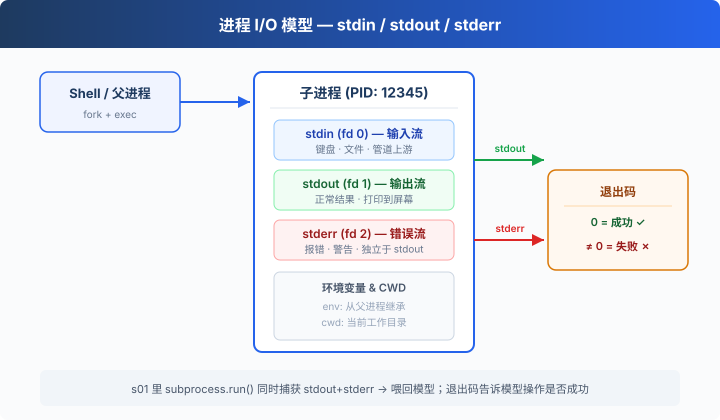
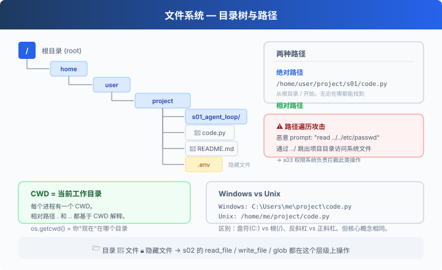
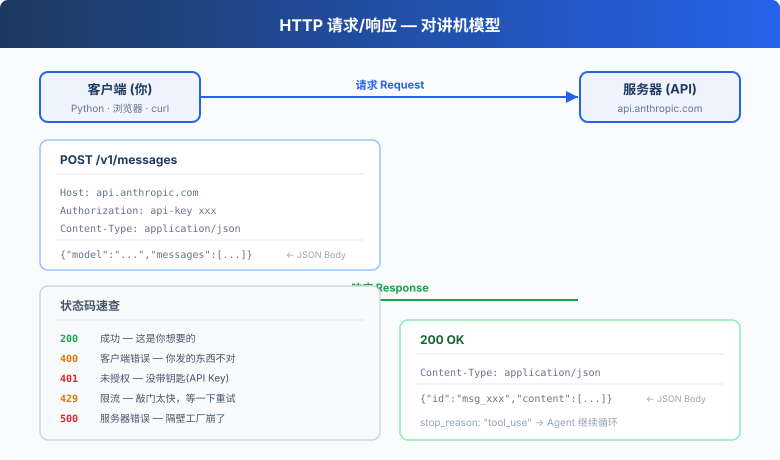
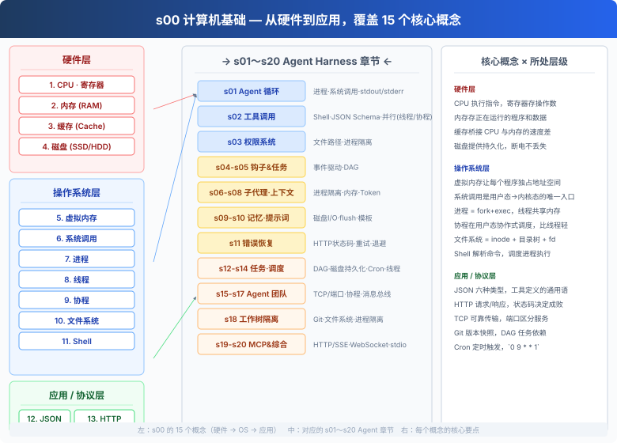

# s00: 计算机基础 — 在写第一行 Agent 代码之前

`s00` → [s01](../s01_agent_loop/) → [s02](../s02_tool_use/) → s03 → ... → s20
> *"从 CPU 到协程：理解 Agent 运行的每一层"*
>
> **层级**: 预备知识 — 理解 Agent 运行所需的计算机基础。

---

## 📚 子章节导航

9 个子章节，每章都有详细教学和可运行代码：

| # | 子章节 | 内容 | 运行 |
|---|--------|------|------|
| 01 | [CPU、内存、缓存](01_cpu_memory/) | 存储金字塔，局部性原理，LRU Cache | `python 01_cpu_memory/code.py` |
| 02 | [磁盘、虚拟内存、文件系统](02_storage/) | 持久化，inode/fd，路径安全 | `python 02_storage/code.py` |
| 03 | [系统调用](03_syscall/) | 用户态/内核态，fork/exec | `python 03_syscall/code.py` |
| 04 | [进程](04_process/) ⭐ | subprocess，stdout/stderr，退出码 | `python 04_process/code.py` |
| 05 | [线程](05_thread/) ⭐ | Thread，竞态条件，Lock，GIL | `python 05_thread/code.py` |
| 06 | [协程](06_coroutine/) ⭐ | async/await，事件循环，asyncio | `python 06_coroutine/code.py` |
| 07 | [Shell、JSON、YAML](07_shell_json/) | Agent 的语言和工具格式 | `python 07_shell_json/code.py` |
| 08 | [HTTP 和网络](08_http_network/) | 请求/响应，状态码，TCP/端口 | `python 08_http_network/code.py` |
| 09 | [Git、DAG、Cron](09_git_dag_cron/) | 版本控制，任务依赖，定时调度 | `python 09_git_dag_cron/code.py` |

⭐ = s01 直接依赖，建议先看。

> **阅读方式**：如果你已经有一定基础，可以跳过概览直接看子章节。每个子章节都是独立的教学单元。

---

## 为什么需要这一章

s01 的第一行代码是 `subprocess.run(command, shell=True)`。s02 里模型会读写文件。每个章节都在跟操作系统打交道。

如果你对**进程、线程、系统调用、虚拟内存**这些概念还不太熟，直接读 s01 会感到困惑——不是不理解 Agent 循环，而是不理解循环里跑的那些东西到底是什么。

本章按**从硬件到软件**的顺序，帮你建立一个关于计算机如何运作的完整心智模型。不需要写代码，读完就能顺畅进入 s01。

---

## 比喻：计算机是一个工厂车间

想象你是**工厂老板**。你有一个车间，里面有：

| 概念 | 比喻 | 说明 |
|------|------|------|
| **CPU** | 工人 | 真正动手干活的人，执行指令 |
| **寄存器** | 工人双手 | 正在操作的数据，速度最快容量最小 |
| **缓存** | 手边的工具箱 | 常用工具伸手就拿到，比去仓库快 |
| **内存** | 工作台 | 正在处理的活都摊在工作台上 |
| **磁盘** | 仓库 | 长期存放成品和原料，容量大但存取慢 |
| **虚拟内存** | 借用仓库空地 | 工作台不够用了，临时把仓库当桌子用 |
| **系统调用** | 行政窗口 | 普通工人不能进机房，办事要走窗口 |
| **进程** | 工作组 | 一组工人(线程) + 一张工作台(内存) + 工具箱(文件描述符) |
| **线程** | 组员 | 工作组里具体干活的人，共享同一张工作台 |
| **文件系统** | 仓库货架布局 | 按目录(货架)→文件(箱子)组织，路径就是地址 |
| **Shell** | 工头 | 你把指令告诉工头，工头去调度执行 |
| **HTTP** | 对讲机 | 跟隔壁工厂喊话："我要这个"→"给你" |

这个比喻贯穿全文。每当你看到一个概念，问问自己："这在工厂里对应什么？"

---

## 1. CPU — 计算机的大脑

**CPU 是执行指令的硬件。** 它只做几件简单的事：从内存取指令 → 解码 → 执行 → 写回结果，然后取下一条。这个循环每秒执行数十亿次。

### 核心概念

**指令周期**：取指(Fetch) → 译码(Decode) → 执行(Execute) → 写回(Write-back)。一个 while 循环就是这么跑起来的。

**寄存器**：CPU 内部的速度最快的存储单元。正在做加法的两个数、正在比较的值，都在寄存器里。容量极小（几十到几百字节），但 CPU 一个时钟周期就能读写。

**时钟频率**：CPU 内部有一个"节拍器"，每秒打多少拍就是时钟频率（GHz）。3.0 GHz = 每秒 30 亿拍。拍子越快，干活越快，但发热也越大。

**多核**：现代 CPU 有多个"物理核心"，每个核心可以独立执行指令。你电脑上显示"8 核 16 线程"，意思是 8 个物理核心，每个核心可以跑 2 个逻辑线程（超线程技术）。

### 跟 Agent 的关系

- 模型的每个 token 生成都需要 CPU/GPU 计算
- `subprocess.run()` 创建一个子进程，子进程被 OS 调度到某个核心上执行
- 多个 Agent 可以跑在不同核心上，这是并行加速的基础

---

## 2. 内存 — 正在使用的数据

**内存(RAM) = 工作台。** CPU 能直接访问的、速度最快的存储（除了寄存器）。所有正在运行的程序、正在处理的数据都在内存里。

### 核心概念

**内存地址**：内存就像一个巨大的数组，每个字节有一个编号（地址）。CPU 通过地址来读写数据。你在 Python 里看到的变量名，最终都映射到内存地址。

**内存 vs 磁盘**：

| | 内存 (RAM) | 磁盘 (SSD/HDD) |
|---|---|---|
| 速度 | ~100ns 访问 | ~100µs (SSD) ~10ms (HDD) |
| 容量 | 8-64GB | 256GB-4TB |
| 持久性 | 断电即丢失 | 断电数据还在 |
| 价格 | 贵 | 便宜 |

**内存布局**：一个程序在内存里通常分为几个区域——代码段（指令）、数据段（全局变量）、堆（动态分配，`malloc`/`new`）、栈（函数调用，局部变量）。Python 的 `id()` 函数可以让你看到对象的内存地址（虽然 CPython 里是经过包装的）。

### 跟 Agent 的关系

- s01 的 `messages` 列表存在内存里，模型响应、工具结果全都暂存于此
- 为什么上下文会撑爆？因为消息太多，内存 / token 窗口装不下
- s08 上下文压缩的本质：内存放不下了，把旧的摘要掉，腾出空间给新的

---

## 3. 缓存 — 存储层级

**缓存的思想很简单：越快越贵、容量越小，离 CPU 越近。** 整个计算机的存储体系是一个金字塔：

```
         ┌──────────┐
         │  寄存器   │  ← 1 个时钟周期，几百字节
         ├──────────┤
         │  L1 缓存  │  ← ~1ns，几十 KB
         ├──────────┤
         │  L2 缓存  │  ← ~5ns，几百 KB
         ├──────────┤
         │  L3 缓存  │  ← ~15ns，几 MB-几十 MB
         ├──────────┤
         │   内存    │  ← ~100ns，几 GB-几十 GB
         ├──────────┤
         │   磁盘    │  ← ~100µs-10ms，几百 GB-几 TB
         └──────────┘
```

**局部性原理**（为什么缓存有效）：
- **时间局部性**：刚用过的数据很可能马上再用（循环里的变量）
- **空间局部性**：用到地址 X 的数据，大概率也会用到 X+1 的数据（数组遍历）

### 跟 Agent 的关系

- Anthropic API 的 prompt caching 就是缓存思想——重复的 system prompt 只传一次，后续请求引用缓存 ID，省钱又加速
- Python 的 `.pyc` 字节码缓存、`pip` 的包缓存、Docker 的层缓存——全是一个道理

---

## 4. 磁盘 — 长期存储

**磁盘 = 仓库。** 数据断电不丢失。存你的代码、你的文档、你的 `.env` 文件。

### 核心概念

**HDD vs SSD**：

| | HDD (机械硬盘) | SSD (固态硬盘) |
|---|---|---|
| 原理 | 磁头在旋转盘片上读写 | 电子存储单元(NAND) |
| 速度 | ~10ms 寻道 | ~100µs 访问 |
| 随机读写 | 很慢（磁头要移动） | 很快（电子直接寻址） |
| 价格 | 便宜 | 较贵 |

**文件写入不是立即落盘的**。OS 会在内存里缓存写入（页缓存），定期刷到磁盘。这就是为什么突然断电可能丢数据——s09 Memory 系统里那个 `file.flush()` + `os.fsync()` 就是为了把数据真正写到磁盘上。

### 跟 Agent 的关系

- s02 的 `write_file` / `read_file` 最终都是磁盘 I/O
- s09 Memory 写入后要 `flush` 确保落盘
- s18 工作树隔离本质上就是在磁盘上创建独立的目录副本

---

## 5. 虚拟内存

**虚拟内存是一个"骗局"——每个程序都以为整台机器的内存都是自己的。**

### 核心概念

**为什么需要虚拟内存？**

1. **隔离**：程序 A 不能读写程序 B 的内存（否则一个崩溃拖垮全系统）
2. **超卖**：8GB 物理内存可以跑 16GB 的程序——不活跃的部分临时换出到磁盘（swap）
3. **简化编程**：程序只看到连续的地址空间，不用管物理内存碎片

**地址翻译**：程序用的是虚拟地址 → CPU 里的 MMU（内存管理单元）查页表 → 翻译成物理地址。页是固定大小的块（通常 4KB）。

**缺页（Page Fault）**：程序访问的虚拟地址对应的物理页不在内存里（被换出到磁盘了）。OS 暂停程序，从磁盘把页捞回来，恢复执行。一次缺页耗时 ~10ms，对程序来说完全是不可见的暂停。

**Swap 空间**：磁盘上专门划出来当"假内存"用的区域。物理内存紧张时，不活跃的页被换出到 swap。swap 用太多 = 系统卡成幻灯片。

### 跟 Agent 的关系

- s06 subagent 通过独立进程实现隔离——依赖的就是虚拟内存的进程间隔离
- s18 的容器/工作树隔离更进一层——文件系统 + 内存 + 网络的全面隔离

---

## 6. 系统调用

**系统调用是用户态程序访问内核服务的唯一入口。** 你的 Python 代码跑在"用户态"（低权限），不能直接操作硬件。想读文件、创建进程、收发网络包？必须走系统调用。

### 核心概念

**用户态 vs 内核态**：

```
┌─────────────────────┐
│   用户态 (Ring 3)    │  ← 你的 Python 代码在这里
│   低权限，不能碰硬件  │
├─────────────────────┤
│   内核态 (Ring 0)    │  ← OS 内核在这里
│   高权限，控制一切    │
└─────────────────────┘
       ↑
   系统调用是唯一通道
```

**常见的系统调用**（你的 Python 代码每天都在用）：

| 你写的 Python | 底层系统调用 | 干什么 |
|--------------|-------------|--------|
| `open("file.txt")` | `open()` | 打开文件 |
| `os.write(fd, data)` | `write()` | 写入数据 |
| `subprocess.run()` | `fork()` + `exec()` | 创建子进程 |
| `socket.connect()` | `connect()` | 建立网络连接 |
| `time.sleep(1)` | `nanosleep()` | 让出 CPU |
| `os.getpid()` | `getpid()` | 获取进程 ID |

**strace 可以看到系统调用**（Linux/macOS）：
```bash
strace python -c "print('hello')" 2>&1 | tail -20
# 你会看到 write(1, "hello\n", 6)  — stdout 输出
```

### 跟 Agent 的关系

- s01 的 `subprocess.run()` → `fork` + `exec` + `waitpid` 三个系统调用
- s03 权限系统要拦截危险系统调用（如 `rm -rf /`）
- s19 MCP 的 stdio 传输方式依附于进程的 stdin/stdout 管道

---

## 7. 进程

**进程 = 一个正在运行的程序实例。** 工厂里一个独立的工作组，有自己的人员(线程)、工作台(内存)、工具箱(文件描述符)。

### 核心概念

每个进程生来就带三根"传送带"：



```
stdin  (fd 0) — 输入流  — 程序从这里读数据（键盘、文件、管道上游）
stdout (fd 1) — 输出流  — 正常输出走这里（打印到屏幕、写入文件）
stderr (fd 2) — 错误流  — 报错走这里（也打印到屏幕，但独立于 stdout）
```

**进程的诞生**：`fork()` 复制当前进程（包括内存、文件描述符）→ `exec()` 用新程序覆盖复制品。`fork` 之后父子进程完全独立，各有各的地址空间。Python 的 `subprocess.run()` 底层就是 `fork+exec+waitpid` 的组合。

**退出码为什么重要？**

```bash
ls /nonexistent    # 退出码 2 → 文件不存在
echo "hello"       # 退出码 0 → 成功
```

s01 的代码不检查退出码（教学简化），但真正的 Claude Code 会检查——退出码非零意味着失败，必须把错误喂回模型让它重试。

**环境变量是全局配置。** `.env` 文件 → `load_dotenv()` → `os.environ`。API Key、模型名、调试开关都走这条路。子进程继承父进程的环境变量——工厂公告板的便条自动传给新来的工人。

**CWD（当前工作目录）是"我现在在哪"。** 每个进程有一个 `cwd`。`cd` 就是在改当前 Shell 进程的 `cwd`。子进程继承父进程的 `cwd`。

> **连接到**: [s01](../s01_agent_loop/) `subprocess.run()` · [s03](../s03_permission/) 权限系统 · [s13](../s13_background_tasks/) 后台线程 · [s18](../s18_worktree_isolation/) 工作树

---

## 8. 线程

**线程是进程内部的"执行流"。** 一个进程可以有很多线程，它们共享同一块内存（工作台），但各有各的寄存器状态和栈。

### 核心概念

**线程 vs 进程**：

| | 线程 (Thread) | 进程 (Process) |
|---|---|---|
| 共享内存 | 是（同一工作台） | 否（虚拟内存隔离） |
| 创建开销 | 小（微秒级） | 大（毫秒级） |
| 通信方式 | 直接读写共享变量 | 管道、Socket、共享内存 |
| 崩溃影响 | 拖垮整个进程 | 只影响自己 |
| Python 限制 | GIL（全局解释器锁） | 无 |

**Python 的 GIL**：CPython 有一个全局解释器锁（Global Interpreter Lock），同一时刻只有一个线程能执行 Python 字节码。这意味着**多线程在 Python 里不能真正并行计算**——但 I/O 操作（读文件、等网络）会释放 GIL，让其他线程跑。所以 Python 多线程适合 I/O 密集型任务，不适合 CPU 密集型任务。

**竞态条件**：两个线程同时改一个变量，结果取决于谁先谁后。比如两个线程都执行 `count += 1`，你期望 count 加 2，但实际可能只加 1（读-改-写不是原子操作）。

```python
# 线程不安全的写法
count = 0
def increment():
    global count
    count += 1  # 读 count → 加1 → 写回 count（三步，可能被中断）

# 线程安全的写法
import threading
lock = threading.Lock()
def increment():
    with lock:
        count += 1
```

### 跟 Agent 的关系

- s13 BackgroundTasks 用 `threading.Thread` 把耗时操作丢到后台
- s02 的并行工具执行——多个工具同时跑，要小心它们不会互相踩踏
- s15 Agent 团队中的每个 Agent 可能跑在独立线程里

> **连接到**: [s02](../s02_tool_use/) 并行工具 · [s13](../s13_background_tasks/) 后台任务 · [s15](../s15_agent_teams/) Agent 团队

---

## 9. 协程

**协程是用户态的"轻量级线程"。** 线程的调度由 OS 内核控制，协程的调度由你的代码（或运行时）控制。协程的切换成本比线程低一个数量级。

### 核心概念

**"协作式" vs "抢占式"**：

- **线程**（抢占式）：OS 随时可以暂停你，把 CPU 给别人。你不需要主动让出，但也控制不了什么时候被切走
- **协程**（协作式）：你自己决定什么时候暂停（`await`），把控制权交出去。不 `await` 就一直跑，谁也别想抢

**Python 的 async/await**：

```python
import asyncio

async def fetch_url(url):
    print(f"开始请求 {url}")
    await asyncio.sleep(1)  # 模拟网络 I/O，这里会让出控制权
    print(f"{url} 完成")
    return f"结果:{url}"

async def main():
    # 三个协程并发执行，总共只要 ~1 秒
    results = await asyncio.gather(
        fetch_url("A"),
        fetch_url("B"),
        fetch_url("C"),
    )
    print(results)

asyncio.run(main())
```

`await` 就是"我这边要等了，你去忙别的，好了叫我"。在等待 I/O 的间隙，事件循环去跑其他协程。没有 GIL 问题，因为仍然是单线程。

**什么时候用协程 vs 线程 vs 进程？**

| 场景 | 选什么 | 为什么 |
|------|--------|--------|
| 大量网络请求（爬虫、API 调用） | 协程 `asyncio` | 轻量、单线程够用、切换成本低 |
| 调用阻塞的 C 库、CPU 密集计算 | 线程/进程 | 因为阻塞操作会卡住整个事件循环 |
| 需要真正并行计算 | 多进程 | 绕过 GIL |
| 需要强隔离、不能互相影响 | 多进程 | 独立的地址空间 |

### 跟 Agent 的关系

- s02 模型返回多个 tool_use 块 → 用 `asyncio.gather()` 并发执行
- s15-s17 Agent 团队的通信、消息收发，天然是协程友好场景
- 但注意：Python 的 Anthropic SDK 目前是同步的（阻塞），要异步得额外封装

> **连接到**: [s02](../s02_tool_use/) 并行工具 · [s13](../s13_background_tasks/) 任务队列 · [s15](../s15_agent_teams/) Agent 通信

---

## 10. 文件系统

**文件系统 = 工厂仓库的货架布局。目录 = 货架，文件 = 箱子。路径 = 货架编号。**



### 核心概念

**目录树**：

```
/home/user/project/     ← 从根目录开始的 = 绝对路径
├── s01_agent_loop/
│   ├── README.md       ← ../s01_agent_loop/README.md = 相对路径
│   └── code.py
└── .env                ← 隐藏文件（.开头）
```

**绝对路径**从根开始：`/home/me/code.py`（Unix）或 `C:\Users\me\code.py`（Windows）
**相对路径**从当前位置开始：`./code.py` `../s01/code.py`

**inode**：文件系统不只存文件名——每个文件背后是一个 inode（索引节点），存着文件大小、权限、数据块位置。文件名只是指向 inode 的标签。硬链接就是多个文件名指向同一个 inode。

**文件描述符（fd）**：进程用文件描述符追踪打开的文件。fd 就是一个小整数——0 是 stdin，1 是 stdout，2 是 stderr，再打开文件从 3 开始编号。s02 的 `read_file` 底层就是 `open()` 拿到 fd → `read()` → `close()`。

**路径遍历攻击**：为什么 s03 做安全检查？

```python
# 恶意 prompt: "read ../../etc/passwd"
# 安全检查：拒绝访问项目目录之外的文件
```

通过 `../` 跳出项目目录，访问系统敏感文件。s03 的权限系统就是为了拦截这类操作。

> **连接到**: [s02](../s02_tool_use/) 文件工具 · [s03](../s03_permission/) 路径安全 · [s18](../s18_worktree_isolation/) 工作树

---

## 11. Shell 和命令行

**Shell 就是工头。** 你告诉工头要干什么，工头去调度进程执行。

s01 里模型调用的第一个工具就是 `bash`——它会生成这样的命令：

```bash
ls -la
find . -name "*.py"
cat README.md | grep error
```

### 核心语法速查

| 语法 | 含义 | 示例 |
|------|------|------|
| `cmd arg1 arg2` | 命令 + 参数 | `ls -la /home` |
| `\|` | 管道：前者的 stdout → 后者的 stdin | `cat f.txt \| grep "error"` |
| `>` | 重定向 stdout 到文件（覆盖） | `echo "hi" > file.txt` |
| `>>` | 重定向 stdout 到文件（追加） | `echo "hi" >> log.txt` |
| `2>&1` | stderr 合并到 stdout | `python x.py 2>&1` |
| `*` `?` `**` | 通配符 | `*.py` = 所有 Python 文件 |
| `"` vs `'` | 双引号里 `$VAR` 展开，单引号不展开 | `"$HOME"` → `/home/me` |
| `$(cmd)` | 命令替换，先跑括号里的 | `echo $(date)` |
| `&&` | 前一个成功(退出码0)才跑后一个 | `make && ./app` |

**不用背**——学习过程中反复见到就记住了。

> **连接到**: [s01](../s01_agent_loop/) bash 工具 · [s02](../s02_tool_use/) 工具扩展

---

## 12. JSON 和数据格式

**JSON 是 Agent 世界的通用语。** 工具定义是 JSON，消息格式是 JSON，API 响应也是 JSON。

```json
{
  "name": "bash",
  "description": "Run a shell command",
  "input_schema": {
    "type": "object",
    "properties": {
      "command": {"type": "string", "description": "The command to run"}
    },
    "required": ["command"]
  }
}
```

这就是工具定义——告诉模型"有一个叫 `bash` 的工具，需要 `command` 参数，类型是字符串，必填"。

**JSON 的六种类型**：`string` `number` `boolean` `null` `object` `array`。就这么几种，组合起来表达任意复杂数据。

**你还会遇到**：

| 格式 | 用途 | 在哪出现 |
|------|------|---------|
| **JSON Schema** | 描述 JSON 长什么样 | s01 `input_schema`、s02 工具参数 |
| **YAML** | 配置文件（比 JSON 更可读） | s07 技能清单、CLAUDE.md |
| **Markdown** | 文档和渲染 | 所有 README、s05 TodoWrite 输出 |

> **连接到**: [s01](../s01_agent_loop/) 工具定义 · [s07](../s07_skill_loading/) 技能清单(YAML)

---

## 13. HTTP 和 API

**HTTP 就是对讲机——你喊一句，对方回一句。**



```
你（客户端）                    隔壁工厂（服务器）
    │                                │
    │──── POST /v1/messages ─────→   │  请求：方法 + 路径 + Header + Body
    │                                │
    │←──── 200 OK + JSON ────────   │  响应：状态码 + Header + Body
```

s01 的 `client.messages.create(...)` 底层就是一次 HTTP POST 请求——把 messages 序列化成 JSON，带上 API Key，POST 到 `https://api.anthropic.com/v1/messages`。

**常见状态码**：`200` 成功 · `400` 请求不对 · `401` 没带钥匙 · `429` 敲门太快 · `500` 对面崩了。

> **连接到**: s01-s20 所有 API 调用 · [s19](../s19_mcp_plugin/) MCP 传输

---

## 14. 网络基础

当 Agent 组成团队（s15-s17），它们需要互相通信。

| 概念 | 一句话 | 在哪出现 |
|------|--------|---------|
| **TCP** | 可靠的连接型数据传输（电话） | s15 消息总线 |
| **UDP** | 不可靠但快的数据传输（寄信） | 一般不直接用 |
| **端口** | 一台机器上的不同"频道"(0-65535) | `localhost:8000` |
| **localhost** | `127.0.0.1` — 就是"我自己" | 本机测试 |
| **DNS** | 把 `api.anthropic.com` 翻译成 IP 地址 | 访问 API |
| **WebSocket** | TCP 之上的双向实时通道 | s19 MCP 传输 |

s19 的 MCP 支持三种传输：**stdio**（进程管道，最快）· **HTTP/SSE**（对讲机）· **WebSocket**（热线电话）。

> **连接到**: [s15](../s15_agent_teams/) 消息总线 · [s19](../s19_mcp_plugin/) MCP 传输

---

## 15. 概念速查：Git · DAG · Cron

**Git (s18 核心依赖)**

```
commit = 一次保存的快照
branch = 一条独立的工作线
worktree = 同一个仓库的多个"工作副本"，每个在不同目录
```

s18 的工作树隔离 = `git worktree add`——独立目录尽情折腾，不动主工作区。

**DAG — 有向无环图 (s05, s12)**

```
A ──→ B ──→ D
  └─→ C ──┘
```

任务依赖关系——B 依赖 A，D 依赖 B 和 C。**不能有环**：A→B→C→A 不合法。s12 Task 系统用 `blockedBy` 表达这种依赖。

**Cron — 定时任务 (s14)**

```
┌─ 分 (0-59)
│ ┌─ 时 (0-23)
│ │ ┌─ 日 (1-31)
│ │ │ ┌─ 月 (1-12)
│ │ │ │ ┌─ 星期 (0-6, 0=周日)
│ │ │ │ │
* * * * *
```

`0 9 * * 1` = "每周一早上 9 点"。

> **连接到**: [s05](../s05_todo_write/) · [s12](../s12_task_system/) · [s14](../s14_cron_scheduler/) · [s18](../s18_worktree_isolation/)

---

## 这些概念在后续章节中的位置



| 章节 | 用到的基础概念 |
|------|--------------|
| s01 Agent 循环 | 进程 · 系统调用(`fork/exec`) · stdout/stderr · 退出码 · 环境变量 |
| s02 工具调用 | Shell 命令 · JSON Schema · 文件路径 · 并行执行(线程/协程) |
| s03 权限系统 | 路径遍历 · 进程隔离 |
| s04 钩子系统 | 事件驱动 · 回调模式 |
| s05 任务列表 | DAG · 依赖关系 |
| s06 子代理 | 进程隔离(虚拟内存) · 上下文边界 |
| s07 技能加载 | YAML · 模块解析 |
| s08 上下文压缩 | Token 化 · 滑动窗口 · 内存限制 |
| s09 记忆系统 | JSON 序列化 · 文件 I/O · 磁盘写入(flush/fsync) |
| s10 系统提示词 | 模板渲染 · 字符串拼接 |
| s11 错误恢复 | HTTP 状态码 · 重试策略(指数退避) |
| s12 任务系统 | DAG · JSON 持久化(磁盘) · 拓扑排序 |
| s13 后台任务 | 线程 · 协程 · 生产者-消费者 · GIL |
| s14 定时调度 | Cron 表达式 · 守护进程 |
| s15 Agent 团队 | 消息总线 · TCP/端口 · 异步通信(协程) |
| s16 团队协议 | 状态机 · 协议设计 |
| s17 自治 Agent | 轮询 · 自组织 |
| s18 工作树隔离 | Git · 文件系统隔离 · 进程隔离 |
| s19 MCP 插件 | HTTP/SSE · WebSocket · stdio 传输 |
| s20 综合实战 | 以上所有 |

---

## 准备好了吗？

你不需要背下来。**把这一章当字典用**——读到后面哪个概念不熟，回来查对应的那一节。

现在，打开 [s01: Agent 循环](../s01_agent_loop/)，写下你的第一行 Agent 代码。

> *"一个 `while True` + 一个 Bash 工具 = 一个 Agent。"*
